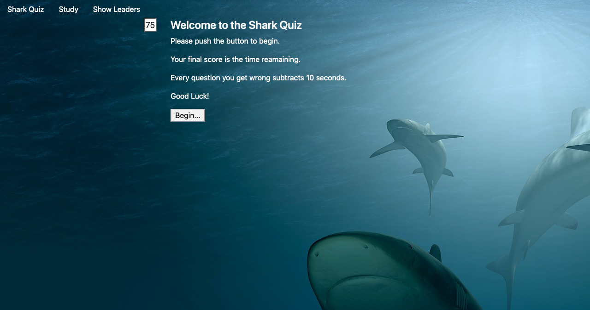

# triva-game

An interactive, mobile friendly trivia game about sharks. The game uses local storage to allow the user to keep a record of their high scores from session to session. 

## The Rules 
The game is 6 questions long with a time limit of 75 seconds. Each incorrect score subtracts 10 from the timer. Once the timer hits zero or the player answers all the questions, the game ends and their final score is the time remaining. 

### [Live Page](https://mercspring.github.io/the-shark-quiz/)
